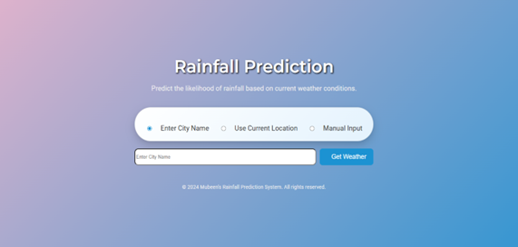

# Rainfall Prediction Web App


---

## Overview

This project is a web-based rainfall prediction system built with **Flask** and a **Random Forest** machine learning model. It predicts the likelihood of rainfall based on real-time weather data (via OpenWeatherMap API), user location, or manual input. The app features a modern, responsive UI and is designed for easy deployment and use.

---

## Features
- 🌦️ Predicts rainfall using weather parameters (pressure, dew point, humidity, cloud, sunshine, wind direction, wind speed)
- 🌍 Fetch weather by city name or current location (geolocation)
- ✍️ Manual input mode for custom weather data
- 📊 Trained on a real-world rainfall dataset
- ⚡ Fast, interactive, and mobile-friendly UI
- 🔒 Environment variable support for API keys

---

## Demo
 <!-- Add a screenshot if available -->

## Tech Stack
- **Backend:** Python, Flask
- **Frontend:** HTML, CSS (custom, responsive), JavaScript
- **ML Model:** Random Forest (scikit-learn)
- **Data:** Custom CSV dataset (`Rainfall.csv`)

---

## Setup & Installation

---

### 1. Clone the Repository
```bash
git clone https://github.com/MubeenEjaz128/Rainfall-Prediction-Randomforest.git
cd "Rain Fall"
```
---

### 2. Create a Virtual Environment (Recommended)
```bash
python -m venv venv
source venv/bin/activate  # On Windows: venv\Scripts\activate
```

---

### 3. Install Dependencies
```bash
pip install -r requirements.txt
```

---

### 4. Set Up Environment Variables

Create a `.env` file in the project root (do **not** commit this file to GitHub):
```env
WEATHER_API_KEY=your_openweathermap_api_key
```

---

## Security Note
- **Never commit your `.env` file or API keys to GitHub.**
- Add `.env` to your `.gitignore` (see below).

---

## .gitignore Example
```
.env
__pycache__/
*.pyc
venv/
.vscode/
```

---

### 5. Run the App
```bash
python app.py
```
The app will open automatically in your browser at [http://127.0.0.1:5000](http://127.0.0.1:5000).

---

## Usage
- **City Mode:** Enter a city name to fetch weather and predict rainfall.
- **Current Location:** Use your device's location to fetch weather and predict.
- **Manual Mode:** Enter weather parameters manually for prediction.
- **Result:** The app displays "Rainfall" or "No Rainfall" based on the model's prediction.

---

## Dataset
- **File:** `Rainfall.csv`
- **Columns:** `pressure`, `dewpoint`, `humidity`, `cloud`, `sunshine`, `winddirection`, `windspeed`, `rainfall`
- **Target:** `rainfall` (yes/no, encoded as 1/0)
- **Source:** Custom/collected dataset (see notebook for details)

---

## Model Training
- See [`Rainfall_Prediction_using_Machine_Learning.ipynb`](Rainfall_Prediction_using_Machine_Learning.ipynb) for full data cleaning, feature selection, model training, and evaluation steps.
- **Algorithm:** Random Forest Classifier (scikit-learn)
- **Accuracy:** ~74% on test set
- **Model File:** `rainfall_prediction_model.pkl`

---

## Environment Variables
- `WEATHER_API_KEY`: Your OpenWeatherMap API key (required for live weather fetching)

---

## File Structure

```text
Rain Fall/
│
├── app.py                                  # Flask backend
├── Rainfall_Prediction_using_Machine_Learning.ipynb   # Model training notebook
├── rainfall_prediction_model.pkl            # Trained ML model
├── Rainfall.csv                            # Dataset
├── requirements.txt                        # Python dependencies
├── static/
│   ├── style.css                           # Custom styles
│   ├── script.js                           # Frontend logic
│   └── screenshot.png                      # App screenshot
├── templates/
│   └── index.html                          # Main UI
├── .gitignore                              # Git ignore file
└── README.md                               # Project documentation
```

---

## Credits
- **Developed by:** Mubeen
- **ML/DS Notebook:** See included Jupyter notebook for full workflow
- **UI/UX:** Custom, responsive, modern design

---

## License
This project is for educational and demonstration purposes. Please contact the author for other uses.

---

*Made with ❤️ using Python, Flask, and Machine Learning.*